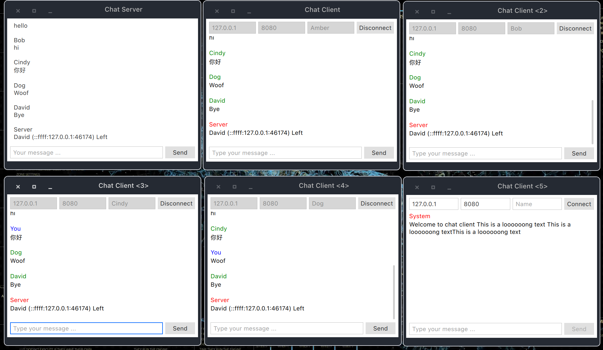
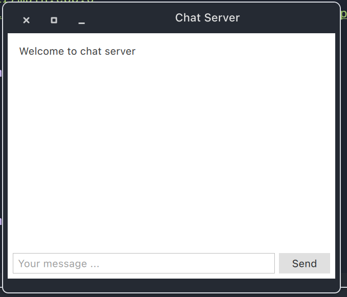

# Socket_server
A Socket server implement by QT 5.15

## Dependency
- Ubuntu 18.04
    - build-essential
    - cmake
    - mesa-common-dev
    - libglu1-mesa-dev
    - qt515base
    - qt515quickcontrols2
```sh
sudo apt install build-essential cmake mesa-common-dev libglu1-mesa-dev
```
Because Ubuntu 18.04 QT version is too old, you have to add this ppa to your apt mananger.
    
```shell=
# add ppa
sudo add-apt-repository ppa:beineri/opt-qt-5.15.2-bionic
sudo apt update
sudo apt install qt515base qt515quickcontrols2
```
And add to your PATH
```shell=
# add to PATH
sudo vim /etc/profile
# add this line in the files
export $PATH="/opt/qt515/bin:$PATH"
# source the profile or relogin to take effect
source /etc/profile
```
- Arch linux
    - base-devel
    - cmake
    - qt5-base
    - qt5-quickcontrols2
## Compile
- clone this repository
- make a directory and enter
```shell=
mkdir -p build && cd biuld
```
- generate cmake configuration
```shell=
cmake ..
```
- build
```shell=
cmake --build .
```
## Usage
1. Open and start listening...

